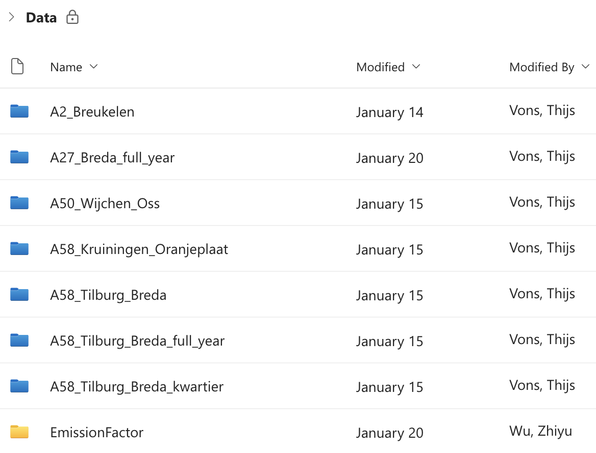

# Goal 3: Cooperation and Data Sharing within the Group
## Overview
In this document, I will include the main learning results of this goal, which include:
- A brief introduction of collaborative methodologies, including the application in our project
- A document about our group's data-sharing strategies
- A critical reflection on the group project's management, what went well and what can be improved

## Background
In my previous Master's courses, group work experiences varied significantly. I encountered these challenges through my program:
- Lack of systematic documentation
- Minimal opportunities for process reflection
- Inconsistent task tracking and contribution recording

This goal aimed to develop more effective teamwork skills, focusing on organized data and script sharing, and implementing structured collaboration methods.

## Methodology and Collaborative Approach
### Teamwork Strategies
- Personal log of daily work
- Organize daily group reflection meetings, and maintain good data-sharing behaviours
- Consistent documentation (todo list for tomorrow at the end of the day)
- Agile-inspired project management techniques

### Tools and Platforms
- Teams channel for code and document sharing
- Regular communication channels: Whatsapp 
- Collaborative documentation practices: Onedrive and Arcgis Storymaps

## Results
### Popular Collaborative Methods 
#### AGILE
The Agile methodology is popular among product teams because it allows them to create products faster that meet customer needs better. Though Agile's roots are in software development, it's very effective in design as well. In this article, we’ll review the concept of Agile design and learn how it can help product teams deliver products faster without degrading the resulting user experience.
The product requirements that a team has at the beginning of the design process aren’t set in stone—they can evolve during the product development. Product teams can change design direction based on feedback from users and stakeholders. Having shorter timeframes to work within before a release also helps to keep the teams focused during the Agile process.

*Comparison between traditional waterflow method and agile workflow*

#### Kanban 
A kanban board is an agile project management tool designed to help visualize work, limit work-in-progress, and maximize efficiency (or flow). It can help both agile and DevOps teams establish order in their daily work. Kanban boards use cards, columns, and continuous improvement to help technology and service teams commit to the right amount of work, and get it done!

Kanban board example

A kanban board divides tasks in to sections like backlog, doing, review, done. Therefore, we can see the priorities in the project as well as things waiting to be discussed/changed, showing how things have been processed. 

#### Critical Pathe Methods
The critical path method cpm, also called critical path analysis, is used to identify and schedule your project’s critical tasks and all their dependencies. The longest sequence of critical tasks will constitute the critical path and establish your project timeframe. It is quite helpful for determining the priority of your projects’ activities, reassigning the team roles, evaluating risks, and distributing resources.

Critical Path Method Workflow

This method allows you to schedule crucial tasks better and complete the project as quickly as possible without any critical steps missed. However, everything needs to be carefully planned initially. Thus, those with little real-world scheduling and project planning experience may find it hard to calculate the time and distribute resources to each activity accurately.

This method is most appropriate for projects with interdependent components. Therefore, you can use it when required to get a task finished before another can begin with flexibility or prefer a visual way to map out the tasks’ sequence.

### Group Traffic 1's Data-sharing Strategies:

Our group developed a systematic approach to handling research data. Thijs Vons was responsible for downloading large traffic-related datasets through his Dexter account. We implemented daily morning meetings to discuss data collection progress, identify missing information, and coordinate data acquisition.

Folders that store raw data files

We established strict data handling protocols to maintain data integrity and protect sensitive information. Raw data access was limited exclusively to group members, ensuring confidentiality. All uploaded datasets will be automatically deleted after six months, mitigating potential information leakage risks and optimizing storage management.

Data and code management folders

We committed to maintaining transparency and reproducibility by storing processed data alongside the corresponding data processing scripts. This approach ensures that our data transformation methods remain clear and traceable throughout the research process.

### Our Project Management: Strength and Weakness
**Strengths:**
Our team started with a clear project plan, using each member's unique expertise. Effective time management allowed us to complete most deliverables by the end of Week 2, demonstrating strong initial coordination and productivity.

**Weaknesses:**
As the project progressed, our team became less adaptable. We reduced our daily meetings during the final week, particularly when preparing the presentation. This decreased our team's structure and communication, potentially impacting our collaborative efficiency. I think it would be good if we adapt the agile workflow and kanban method in this project, to make it more flexible and efficient.

## Conclusions and reflection
By learning about Agile project management tools, I discovered how good communication and clear record-keeping can really help group work. Even though our short project didn't show big changes, the lessons were still important for future teamwork.

These tools showed me how tracking progress and sharing information can make working together easier and more effective. The skills I learned will be useful in future group projects, even if we couldn't use them fully this time.

## References
Agile Design: An Introduction. (2020, October 21). Shopify. https://www.shopify.com/partners/blog/agile-design
Designveloper. (2024, October 20). 7 Project management methods besides Agile - designVeloper - medium. Medium. https://dsvgroup.medium.com/7-project-management-methods-besides-agile-7f2a3c26191d
Rehkopf, B. M. (n.d.). What is a kanban board? [Video]. Atlassian. https://www.atlassian.com/agile/kanban/boards
